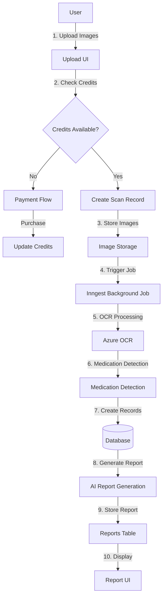

# Complete Cliniq Application - Execution Plan

## Current State Analysis

**Completed:**

- ✅ Authentication (BetterAuth with Polar integration)
- ✅ Profile management (user profiles, conditions)
- ✅ Image upload UI (`MedicationScanner` component)
- ✅ OCR processing (Azure OCR via `ocrRouter`)
- ✅ Basic medication detection from OCR text

**Missing:**

- Database persistence for scans (currently localStorage only)
- Payment/credit system integration
- Background job processing (Inngest)
- Image storage solution
- Report generation (AI summaries)
- Report viewing/sharing UI
- Credit checking before scans
- Payment webhook handling
- RAG context storage
- Scan history UI

## Architecture Flow




## Phase 1: Database Integration for Scans

### 1.1 Create Scans Router

**File:** `src/server/api/routers/scans.ts`

- Create `scansRouter` with tRPC procedures:
- `create`: Create new scan record (status: 'pending')
- `uploadImages`: Store image metadata in `scan_images` table
- `getScan`: Fetch scan with images and medications
- `list`: List user's scans with pagination
- `getScanStatus`: Check processing status

### 1.2 Update OCR Router

**File:** `src/server/api/routers/ocr.ts`

- Modify `analyzeImages` to:
- Accept `scanId` parameter
- Verify scan ownership
- Update `scan_images.ocr_text` after OCR
- Create `scan_medications` records
- Update `scan.status` to 'processed'
- Track OCR metrics in `ocr_metrics` table

### 1.3 Update MedicationScanner Component

**File:** `src/components/MedicationScanner.tsx`

- Replace localStorage with database:
- Create scan record on upload
- Store images via `scans.uploadImages`
- Load medications from `scan_medications` join
- Remove localStorage persistence
- Add scan history loading

### 1.4 Add Scans Router to Root

**File:** `src/server/api/root.ts`

- Add `scans: scansRouter` to `appRouter`

## Phase 2: Image Storage

### 2.1 Choose Storage Solution

**Options:**

- Azure Blob Storage (already using Azure)
- AWS S3
- Cloudinary
- Vercel Blob Storage

**Recommendation:** Azure Blob Storage for consistency

### 2.2 Create Storage Service

**File:** `src/lib/storage.ts`

- Functions:
- `uploadImage(buffer, filename)`: Upload to storage
- `getImageUrl(imageId)`: Get public URL
- `deleteImage(imageId)`: Cleanup

### 2.3 Update Scan Images Storage

**File:** `src/server/api/routers/scans.ts`

- Modify `uploadImages` to:
- Upload files to storage
- Store URLs in `scan_images.image_url`
- Handle errors and cleanup

## Phase 3: Credit System & Payment Integration

### 3.1 Create Credits Router

**File:** `src/server/api/routers/credits.ts`

- Procedures:
- `getBalance`: Get user's credit balance
- `deductCredits`: Deduct credits for scan
- `addCredits`: Add credits from payment
- `checkSufficientCredits`: Validate before scan

### 3.2 Create Payment Router

**File:** `src/server/api/routers/payments.ts`

- Procedures:
- `createCheckout`: Generate Polar checkout session
- `handleWebhook`: Process Polar webhook events
- `getPaymentHistory`: List user payments

### 3.3 Payment Webhook Handler

**File:** `src/app/api/webhooks/polar/route.ts`

- Handle Polar webhook events:
- `checkout.succeeded`: Add credits to `user_credits`
- Create `payments` record
- Update user balance

### 3.4 Credit Checking Middleware

**File:** `src/server/api/middleware/credits.ts`

- Create middleware to check credits before scan operations
- Return error if insufficient credits

### 3.5 Update MedicationScanner for Credits

**File:** `src/components/MedicationScanner.tsx`

- Add credit check before upload
- Show credit balance in UI
- Add "Buy Credits" button linking to Polar checkout
- Handle insufficient credits error

## Phase 4: Background Job Processing (Inngest)

### 4.1 Setup Inngest

**File:** `src/app/api/inngest/route.ts`

- Create Inngest API route handler
- Register functions

### 4.2 Scan Processing Function

**File:** `src/lib/inngest/functions/process-scan.ts`

- Inngest function to:
- Process OCR (if not done)
- Detect medications
- Create `scan_medications` records
- Generate AI report (Phase 5)
- Update `scan_jobs` table with status

### 4.3 Update Scan Creation

**File:** `src/server/api/routers/scans.ts`

- After creating scan, trigger Inngest function
- Create initial `scan_jobs` record (status: 'pending')

## Phase 5: AI Report Generation

### 5.1 Install LangChain Dependencies

```bash
npm install @langchain/core @langchain/openai langchain
```


### 5.2 Create LangChain Tools

**File:** `src/lib/langchain/tools/openfda-tool.ts`

- Tool wrapper for OpenFDA API

**File:** `src/lib/langchain/tools/database-tool.ts`

- Tool to query patient data from database

### 5.3 Create Azure LLM Client

**File:** `src/lib/langchain/llm/azure-llm.ts`

- Configure Azure OpenAI client

### 5.4 Create Report Generation Chain

**File:** `src/lib/langchain/chains/medication-summary-chain.ts`

- Chain that:
- Queries patient profile
- Queries OpenFDA for each medication
- Generates comprehensive summary
- Returns structured report

### 5.5 Create Reports Router

**File:** `src/server/api/routers/reports.ts`

- Procedures:
- `generateReport`: Trigger AI report generation
- `getReport`: Fetch report by ID
- `getScanReports`: Get all reports for a scan
- `shareReport`: Create `report_shares` record

### 5.6 Integrate Report Generation

**File:** `src/lib/inngest/functions/process-scan.ts`

- After medication detection:
- Generate report via LangChain
- Store in `reports` table
- Track metrics in `report_metrics`

## Phase 6: RAG Context Storage

### 6.1 Setup Embeddings

**File:** `src/lib/embeddings.ts`

- Create embedding service (Azure OpenAI embeddings)
- Function to generate embeddings for text

### 6.2 Create RAG Service

**File:** `src/lib/rag/context-storage.ts`

- Functions:
- `storeContext`: Store medication/report context with embeddings
- `searchContext`: Semantic search for relevant context
- Store in `ai_contexts` table

### 6.3 Integrate RAG into Reports

**File:** `src/lib/langchain/chains/medication-summary-chain.ts`

- Add RAG retrieval step before generation
- Use relevant context in prompt

## Phase 7: UI Components

### 7.1 Scan History Page

**File:** `src/app/app/scans/page.tsx`

- List all user scans
- Show status, date, medication count
- Link to scan details

### 7.2 Scan Detail Page

**File:** `src/app/app/scans/[scanId]/page.tsx`

- Display scan images
- Show detected medications
- Display generated reports
- Share report functionality

### 7.3 Reports Page

**File:** `src/app/app/reports/page.tsx`

- List all user reports
- Filter by scan/medication
- View report details

### 7.4 Report Detail/Share Page

**File:** `src/app/app/reports/[reportId]/page.tsx`**File:** `src/app/app/share/[token]/page.tsx`

- Display full report
- Show warnings, interactions
- Share link generation

### 7.5 Credits/Payment UI

**File:** `src/app/app/credits/page.tsx`

- Show credit balance
- Purchase credits button
- Payment history
- Integration with Polar checkout

### 7.6 Update Dashboard

**File:** `src/app/app/dashboard/page.tsx`

- Show recent scans
- Credit balance widget
- Quick actions

## Phase 8: Polish & Testing

### 8.1 Error Handling

- Add proper error boundaries
- Handle API failures gracefully
- User-friendly error messages

### 8.2 Loading States

- Add loading indicators for async operations
- Skeleton screens for data loading

### 8.3 Validation

- Validate file types/sizes
- Credit balance validation
- Input sanitization

### 8.4 Testing

- Test credit deduction flow
- Test payment webhook
- Test scan processing pipeline
- Test report generation

## Implementation Order

1. **Phase 1** (Database Integration) - Foundation
2. **Phase 2** (Image Storage) - Required for Phase 1
3. **Phase 3** (Credits & Payment) - Core business logic
4. **Phase 4** (Inngest) - Background processing
5. **Phase 5** (AI Reports) - Value-add feature
6. **Phase 6** (RAG) - Enhancement
7. **Phase 7** (UI) - User experience
8. **Phase 8** (Polish) - Production readiness

## Key Files to Create/Modify

**New Files:**

- `src/server/api/routers/scans.ts`
- `src/server/api/routers/credits.ts`
- `src/server/api/routers/payments.ts`
- `src/server/api/routers/reports.ts`
- `src/lib/storage.ts`
- `src/lib/inngest/functions/process-scan.ts`
- `src/app/api/inngest/route.ts`
- `src/app/api/webhooks/polar/route.ts`
- `src/lib/langchain/` (multiple files)
- `src/lib/rag/context-storage.ts`
- Multiple UI pages in `src/app/app/`

**Modify Existing:**

- `src/server/api/routers/ocr.ts`
- `src/components/MedicationScanner.tsx`
- `src/server/api/root.ts`
- `src/app/app/dashboard/page.tsx`

## Environment Variables Needed

```env
# Azure Storage (if using)
AZURE_STORAGE_CONNECTION_STRING=
AZURE_STORAGE_CONTAINER_NAME=

# Azure OpenAI (for reports)
AZURE_OPENAI_API_KEY=
AZURE_OPENAI_INSTANCE_NAME=
AZURE_OPENAI_DEPLOYMENT_NAME=

# Inngest
INNGEST_EVENT_KEY=
INNGEST_SIGNING_KEY=

# Polar (already configured)
POLAR_ACCESS_TOKEN=
POLAR_SUCCESS_URL=
```


## Success Criteria

- Users can purchase credits via Polar
- Credits are deducted when scanning
- Scans are persisted in database
- Images stored in cloud storage
- Background jobs process scans asynchronously